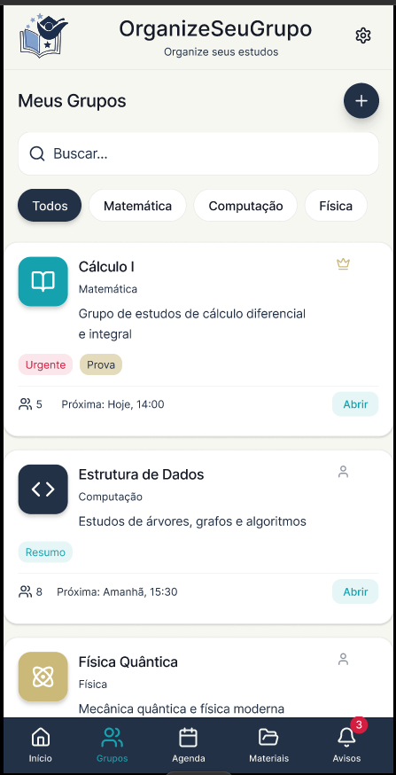
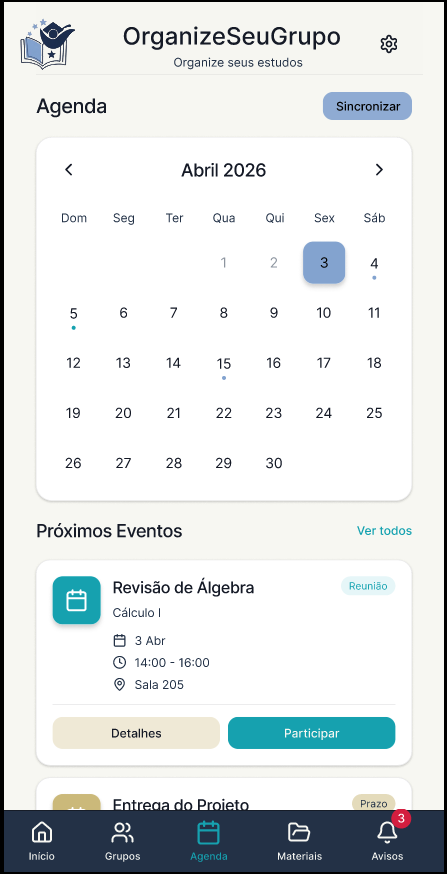
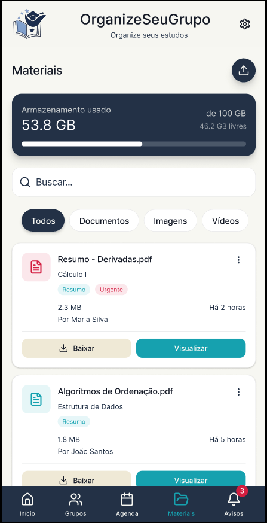

### 1.1.4. Prototype

## Introdução
A fase de **Prototype** é o quarto estágio do Design Sprint. Nesta etapa, a equipe constrói um modelo funcional da solução escolhida, permitindo a visualização das interações e fluxos do sistema antes da implementação técnica. O foco reside na criação de um artefato de médio-alto fidelidade, priorizando os elementos essenciais e as funcionalidades definidas durante as fases de Unpack.

## Protótipo Interativo

Abaixo, é possível interagir diretamente com o protótipo desenvolvido no Figma. Ele simula a experiência do usuário final, navegando pelas telas principais de gestão de grupos de estudo.

Dica: Para uma melhor visualização das interações e detalhes da interface, recomendamos expandir o protótipo para tela cheia clicando no ícone de expansão no canto superior direito do quadro abaixo.

- [Link para o protótipo no Figma](https://www.figma.com/proto/bPuzoT90hSQToEJKYwfTMm/ORGANIZE-SEU-GRUPO?node-id=48-1410&p=f&t=3zd2mIUSqq3Ab5je-1&scaling=min-zoom&content-scaling=fixed&page-id=0%3A1&starting-point-node-id=48%3A1410)

<iframe style="border: 1px solid rgba(0, 0, 0, 0.1); border-radius: 8px;" width="100%" height="700" src="https://embed.figma.com/proto/bPuzoT90hSQToEJKYwfTMm/ORGANIZE-SEU-GRUPO?node-id=48-1410&p=f&scaling=min-zoom&content-scaling=fixed&page-id=0%3A1&starting-point-node-id=48%3A1410&embed-host=share" allowfullscreen></iframe>

#### **Descrição das Telas**:

- **Tela 1:** Tela Inicial
  - **Descrição:** Tela inicial da aplicação, apresenta um dashboard indicando algumas informações importantes como quantidade de grupos ativos, quantidade de próximas reuniões, quantidade de materiais compartilhados recentemente, progresso e uma lista de grupos recentes, em baixo está presente a barra de navegação para ir para outras telas.
  - 

    
<b>Protótipo</b>

    

    

- **Tela 2:** Grupos
  - **Descrição:** A tela de grupos identifica os grupos em que o usuário está inscrito, junto com suas respectivas tags, quantidade de membros, quantidade de materiais e quantidade de reuniões planejadas, além disso é possível buscar por grupos e criar grupos nesta tela.
  - 

    
<b>Protótipo</b>

    

    

- **Tela 3:** Agenda
  - **Descrição:** A tela de agenda mostra uma visão mensal do cronograma do usuário com base nos grupos em que está inscrito e nas reuniões planejadas.
  - 

    
<b>Protótipo</b>

    

    

- **Tela 4:** Materiais
  - **Descrição:** A tela de materiais apresenta uma lista de arquivos disponíveis nos grupos inscritos do usuário, os arquivos possuem tags, identificação do formato, tamanho, usuário responsável pelo upload e data de upload, é possível buscar pelos arquivos ou filtrar por tipo (documento, imagem, vídeo).
  - 

    
<b>Protótipo</b>

    

    

- **Tela 5:** Notificações
  - **Descrição:** Nesta tela é exibido as notificações pendentes do usuário, notificações de novos materiais, reuniões agendadas, prazos e próximos eventos, é possível marcar as notificações como lidas, a quantidade de notificações não lidas está indicada como uma badge em vermelho na navegação para a tela avisos.
  - 

    
<b>Protótipo</b>

    

    

- **Tela 6:** Configurações
    - **Descrição:** Tela em que estão presentes as configurações de perfil, preferências de notificação, aparência (tema escuro ou claro), idioma do aplicativo, link para um FAQ (Perguntas frequentes), link para o GitHub do projeto e um botão com opção de sair da conta logada.
  - 

    
<b>Protótipo</b>

    

    

## Quadro de Colaboração (Etapa 4)
A Tabela 1 apresenta a participação dos membros no desenvolvimento do protótipo de média-alta fidelidade no Figma, focado nas funcionalidades core do projeto.

<a>Tabela 1:</a> Quadro de colaboração na Etapa 4

| **Aluno**                           | **Participação**                                                  |
|-------------------------------------|-------------------------------------------------------------------|
| Camila Cavalcante                    | Contribuiu na elaboração do quadro [Figma](https://www.figma.com/design/bPuzoT90hSQToEJKYwfTMm/ORGANIZE-SEU-GRUPO?node-id=0-1&t=AWdV3q3WzvnIgIxn-1) |
| Eduardo de Pina           | Contribuiu na elaboração do quadro [Figma](https://www.figma.com/design/bPuzoT90hSQToEJKYwfTMm/ORGANIZE-SEU-GRUPO?node-id=0-1&t=AWdV3q3WzvnIgIxn-1) |
| Gabriel Sampaio Fae             | Contribuiu na elaboração do quadro [Figma](https://www.figma.com/design/bPuzoT90hSQToEJKYwfTMm/ORGANIZE-SEU-GRUPO?node-id=0-1&t=AWdV3q3WzvnIgIxn-1) |
| Lucas Alves Oliveira dos Santos               | Contribuiu na elaboração do quadro [Figma](https://www.figma.com/design/bPuzoT90hSQToEJKYwfTMm/ORGANIZE-SEU-GRUPO?node-id=0-1&t=AWdV3q3WzvnIgIxn-1) |
| Luísa de Souza Ferreira              | Contribuiu na elaboração do quadro [Figma](https://www.figma.com/design/bPuzoT90hSQToEJKYwfTMm/ORGANIZE-SEU-GRUPO?node-id=0-1&t=AWdV3q3WzvnIgIxn-1) |
| Mayara Marques Silva               | Contribuiu na elaboração do quadro [Figma](https://www.figma.com/design/bPuzoT90hSQToEJKYwfTMm/ORGANIZE-SEU-GRUPO?node-id=0-1&t=AWdV3q3WzvnIgIxn-1) |
| Thiago Viriato Accioly  | Contribuiu na elaboração do quadro [Figma](https://www.figma.com/design/bPuzoT90hSQToEJKYwfTMm/ORGANIZE-SEU-GRUPO?node-id=0-1&t=AWdV3q3WzvnIgIxn-1) |

<b>Fonte: </b>Autoria de <a href="https://github.com/luisa12ll">Luisa de Souza</a>

