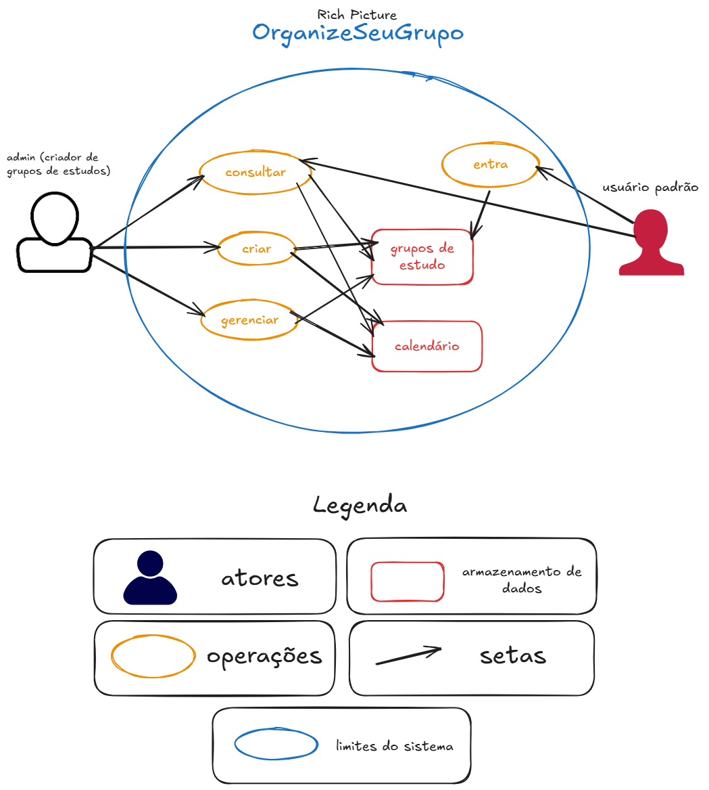
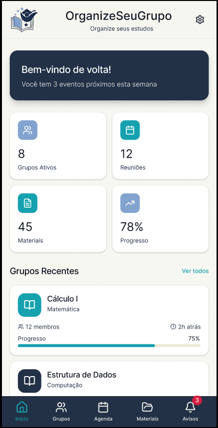
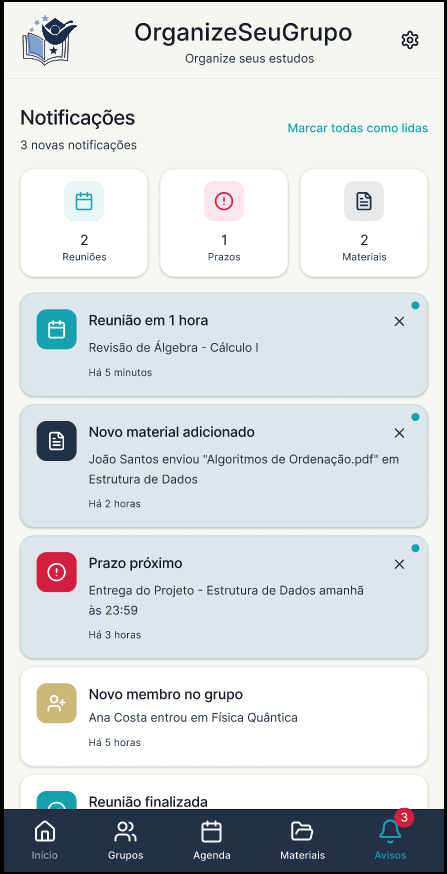
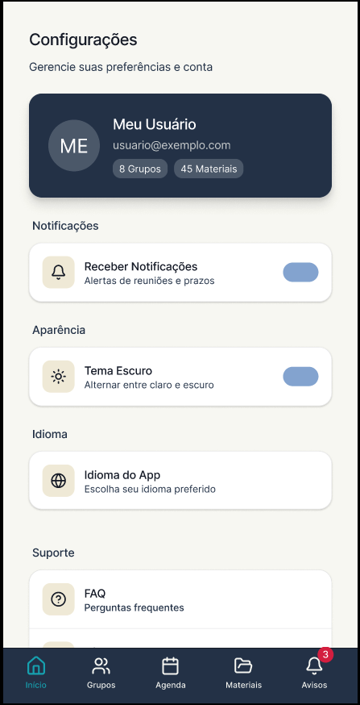

# 1.1. Módulo Design Sprint

## 1. Introdução

O Design Sprint é uma metodologia acelerada de 5 dias para resolver problemas complexos e validar ideias através de design, prototipagem e testes com usuários reais. Criado por Jake Knapp no Google Ventures, o método condensa meses de desenvolvimento em apenas uma semana, permitindo que as equipes aprendam rapidamente sem o custo de lançar um produto final.

Nesta disciplina, adaptamos o fluxo original em partes menores de 30-50 minutos, ao invés de dias, ainda mantendo a mesma base — Unpack, Sketch, Decision, Prototype e Test — para garantir alinhamento, geração de soluções, construção ágil e validação prática.

## 2. Participantes e Contribuições

Inserir tabela de participações com contribuições de cada um evidenciadas.

## 3. Etapas do Design Sprint

O nosso processo padrão seguiu um cronograma de acordo com as 5 etapas:

### 3.1 Unpack -- 1

Na fase Unpack, a ideia é possuir um entendimento profundo do desafio/problema apresentado. A equipe compartilha coleta informações, define objetivos claros e alinha expectativas, fazendo um mapeamento geral do problema.

Aqui, decidimos um usuário hipotético "Eduardo", e definimos uma linha de raciocínio para tal, considerando dificuldades, necessidades e funcionalidades core que resolveriam tais problemas.

- [Link para o quadro do Miro](https://miro.com/app/board/uXjVGp7zBtg=/?share_link_id=96260871432)

<iframe width="768" height="432" src="https://miro.com/app/live-embed/uXjVGp7zBtg=/?embedMode=view_only_without_ui&moveToViewport=-33392,-4813,29197,14674&embedId=756539446472" frameborder="0" scrolling="no" allow="fullscreen; clipboard-read; clipboard-write" allowfullscreen></iframe>

Definimos o possível público alvo do projeto que seriam alunos em geral e vestibulandos, este público geralmente está sempre estudando para concursos/vestibulares e se beneficiam muito de um grupo de estudos centralizado para o que eles precisam.

Supomos que usuários buscariam em um aplicativo de organização de grupo a gestão de agenda/tempo, ícones intuitivos, interface amigável, organização de questões e gestão de vários grupos no caso de professores ou lideres de grupos. Para prover isso definimos algumas funcionalidades principais:

- Selecionar disciplinas;
- Calendário integrado com o grupo;
- Calendário com encontros;
- Gestão de disciplina;
- Login simples de identificação;
- Tags de assunto, disciplina, horários;
- Gerenciamento de grupo;
- Heatmap do grupo;
- Importar/Exportar agenda.

A meta é uma organização de um grupo de estudos de forma fácil e rápida sem a burocracia de login, mostrando uma notificação de reunião e provendo um heatmap com os horários disponíveis de todos os membros do grupo.

Também observamos alguns pontos de risco:

- Agentes externos (trolls, hackers) podem desorganizar grupos, impedir usuários de acessarem a aplicação e contribuirem para uma má reputação do projeto;
- O descostume dos usuários de usar a ferramenta afastariam eles incialmente de tentarem usar a nossa aplicação, tendo em vista que existem outros concorrentes como Trello/Notion, Google Classroom, When2Meet, Passei Direto;
- Se não conseguirmos prover uma aplicação que condiza com as necessidades de accesibilidade do grupo iremos afastar usuários, podendo ser catastrofico nos primeiros dias de lançamento da aplicação;
- Usuários podem perder o login ou serem vítimas de ataques hacker, precisariamos de uma política de recuperação de usuário/senha e uso de boas práticas de segurança para mitigar estes problemas.

<a>Tabela 1:</a> Quadro de colaboração na Etapa 1

| **Aluno**                           | **Participação**                                                  |
|-------------------------------------|-------------------------------------------------------------------|
| Camila Cavalcante                    | Contribuiu na elaboração do quadro [Miro](https://miro.com/app/board/uXjVGp7zBtg=/?share_link_id=96260871432) |
| Eduardo de Pina           | Contribuiu na elaboração do quadro [Miro](https://miro.com/app/board/uXjVGp7zBtg=/?share_link_id=96260871432) |
| Gabriel Sampaio Fae             | Contribuiu na elaboração do quadro [Miro](https://miro.com/app/board/uXjVGp7zBtg=/?share_link_id=96260871432) |
| Júlio César Costa            | Contribuiu na elaboração do quadro [Miro](https://miro.com/app/board/uXjVGp7zBtg=/?share_link_id=96260871432) |
| Lucas Alves Oliveira dos Santos               | Contribuiu na elaboração do quadro [Miro](https://miro.com/app/board/uXjVGp7zBtg=/?share_link_id=96260871432) |
| Luísa de Souza Ferreira              | Contribuiu na elaboração do quadro [Miro](https://miro.com/app/board/uXjVGp7zBtg=/?share_link_id=96260871432) |
| Marcus Vinicius Cunha Dantas     | Contribuiu na elaboração do quadro [Miro](https://miro.com/app/board/uXjVGp7zBtg=/?share_link_id=96260871432) |
| Mayara Marques Silva               | Contribuiu na elaboração do quadro [Miro](https://miro.com/app/board/uXjVGp7zBtg=/?share_link_id=96260871432) |
| Pedro Everton de Paula  | Contribuiu na elaboração do quadro [Miro](https://miro.com/app/board/uXjVGp7zBtg=/?share_link_id=96260871432) |
| Thiago Viriato Accioly  | Contribuiu na elaboração do quadro [Miro](https://miro.com/app/board/uXjVGp7zBtg=/?share_link_id=96260871432) |

<a>Fonte:</a> Autoria de Júlio César Costa

### 3.2 Sketch -- 2

A fase de Sketch (Esboço) constitui a segunda etapa do método Design Sprint. O objetivo desta fase é gerar desenhos de várias alternativas, utilizando como base os conceitos discutidos e acordados na etapa anterior. O foco está em capturar a visão individual de cada membro da equipe sobre o escopo do projeto, permitindo que cada um crie um modelo visual da forma mais completa possível para chegar na solução.

A Tabela 2 apresenta o quadro de colaboração da equipe, detalhando a participação de cada membro na estapa 2.

<a>Tabela 2:</a> Quadro de colaboração do time na Etapa 2

| Aluno | Participação |
| :--- | :--- |
| Camila Cavalcante | Elaboração do Mapa Mental [Miro](https://miro.com/app/board/uXjVGp7zBtg=/?share_link_id=96260871432). |
| Eduardo de Pina | Elaboração do Ishikawa [Miro](https://miro.com/app/board/uXjVGp7zBtg=/?share_link_id=96260871432). |
| Gabriel Sampaio Fae | Elaboração do 5W2H [Miro](https://miro.com/app/board/uXjVGp7zBtg=/?share_link_id=96260871432). |
| Júlio César Costa | Elaboração do Mapa de Empatia e Mapa Mental [Miro](https://miro.com/app/board/uXjVGp7zBtg=/?share_link_id=96260871432). |
| Lucas Alves Oliveira dos Santos | Elaboração do Mapa Mental e 5W2H [Miro](https://miro.com/app/board/uXjVGp7zBtg=/?share_link_id=96260871432). |
| Luísa de Souza Ferreira | Elaboração do Mapa Mental [Miro](https://miro.com/app/board/uXjVGp7zBtg=/?share_link_id=96260871432). |
| Marcus Vinicius Cunha Dantas | Mapa Mental Unificado [Miro](https://miro.com/app/board/uXjVGp7zBtg=/?share_link_id=96260871432). |
| Thiago Viriato Accioly | Elaboração do Ishikawa e 5W2H[Miro](https://miro.com/app/board/uXjVGp7zBtg=/?share_link_id=96260871432). |

<a>Fonte:</a> Autoria de Marcus Vinicius Cunha Dantas

#### Rich Picture
O Rich Picture foi um dos artefatos produzidos pelo grupo na fase 2 da Design Sprint e pode ser observado abaixo:

 Imagem 1 - Rich Picture 1

<figure style="width: 40%; margin-left: auto; margin-right:auto;">

</figure>

<b>Fonte: </b>Autoria de <a href="https://github.com/maymarquee">Mayara Marques</a>

### 3.3 Decision -- 3

Na fase Decision, a equipe revisa todos os esboços, discute os pontos fortes de cada proposta e seleciona as soluções mais promissoras. Assim, definimos o Rich Picture como a melhor amostra do projeto, e então partimos para desenvolver uma nova imagem mais lógica e de fácil entendimento.

- [Decision](./Base/1.1.3.Decision.md)

### 3.4. Prototype -- 4

Em Prototype, construímos um modelo funcional da solução escolhida considerando médio--alto fidelidade, focando nos elementos essenciais e cumprindo as funcionalidades **core** definidas no Brainstorm.

- [Link para o protótipo no Figma](https://www.figma.com/proto/bPuzoT90hSQToEJKYwfTMm/ORGANIZE-SEU-GRUPO?node-id=48-1410&p=f&t=3zd2mIUSqq3Ab5je-1&scaling=min-zoom&content-scaling=fixed&page-id=0%3A1&starting-point-node-id=48%3A1410)

<iframe style="border: 1px solid rgba(0, 0, 0, 0.1);" width="800" height="450" src="https://embed.figma.com/proto/bPuzoT90hSQToEJKYwfTMm/ORGANIZE-SEU-GRUPO?node-id=48-1410&p=f&scaling=min-zoom&content-scaling=fixed&page-id=0%3A1&starting-point-node-id=48%3A1410&embed-host=share" allowfullscreen></iframe>

#### **Descrição das Telas**:

- **Tela 1:** Tela Inicial
  - **Descrição:** Tela inicial da aplicação, apresenta um dashboard indicando algumas informações importantes como quantidade de grupos ativos, quantidade de próximas reuniões, quantidade de materiais compartilhados recentemente, progresso e uma lista de grupos recentes, em baixo está presente a barra de navegação para ir para outras telas.
  - 

    
<b>Protótipo</b>

    

    

- **Tela 2:** Grupos
  - **Descrição:** A tela de grupos identifica os grupos em que o usuário está inscrito, junto com suas respectivas tags, quantidade de membros, quantidade de materiais e quantidade de reuniões planejadas, além disso é possível buscar por grupos e criar grupos nesta tela.
  - 

    
<b>Protótipo</b>

    

    

- **Tela 3:** Agenda
  - **Descrição:** A tela de agenda mostra uma visão mensal do cronograma do usuário com base nos grupos em que está inscrito e nas reuniões planejadas.
  - 

    
<b>Protótipo</b>

    

    

- **Tela 4:** Materiais
  - **Descrição:** A tela de materiais apresenta uma lista de arquivos disponíveis nos grupos inscritos do usuário, os arquivos possuem tags, identificação do formato, tamanho, usuário responsável pelo upload e data de upload, é possível buscar pelos arquivos ou filtrar por tipo (documento, imagem, vídeo).
  - 

    
<b>Protótipo</b>

    

    

- **Tela 5:** Notificações
  - **Descrição:** Nesta tela é exibido as notificações pendentes do usuário, notificações de novos materiais, reuniões agendadas, prazos e próximos eventos, é possível marcar as notificações como lidas, a quantidade de notificações não lidas está indicada como uma badge em vermelho na navegação para a tela avisos.
  - 

    
<b>Protótipo</b>

    

    

- **Tela 6:** Configurações
    - **Descrição:** Tela em que estão presentes as configurações de perfil, preferências de notificação, aparência (tema escuro ou claro), idioma do aplicativo, link para um FAQ (Perguntas frequentes), link para o GitHub do projeto e um botão com opção de sair da conta logada.
  - 

    
<b>Protótipo</b>

    

    

### 3.5. Test -- 5

Na etapa Test, validamos o protótipo com usuários reais, coletando impressões diretas sobre usabilidade e valor por meio de um questionário. Em seguida, apresentamos o protótipo para estes mesmos usuários, obtendo feedbacks sobre cumprimentos de expectativas e valor de uso para as funcionalidades apresentadas.

- [Test](./Base/1.1.5.Test.md)

## 4. Histórico de Versão

| Versão | Data       | Descrição                                 | Autor(es)                                                      | Revisor(es)                                                      |
| :----: | :--------: | ----------------------------------------- | -------------------------------------------------------------- | ---------------------------------------------------------------- |
| 1.0    | 03/04/2026 | Criação da página e organização das etapas de design Sprint     | [Gabriel Fae](https://github.com/Faehzin)               | [Eduardo Pina](https://github.com/eduardodpms)         |
| 1.1   | 03/04/2026 | Documentação da Etapa 2 Sketch    | [Marcus Vinicius](https://github.com/MarcusVcd)               | [Julio Cesar](https://github.com/julnox)         |
| 1.2   | 03/04/2026 | Documentação da Etapa 1 Unpack    | [Julio Cesar](https://github.com/julnox)               | [Marcus Vinicius](https://github.com/MarcusVcd)         |
| 1.3  | 04/04/2026 | Adição de Rich Picture realizado | [Mayara Marques](https://github.com/maymarquee)| [Luisa de Souza](https://github.com/luisa12ll)|
| 1.4  | 04/04/2026 | Documentação do protótipo e correções | [Julio Cesar](https://github.com/julnox)               | [Marcus Vinicius](https://github.com/MarcusVcd) |