# 1.2. Artefato Generalista

## 1.2.1. Introdução

Na Engenharia e Arquitetura de Software, chamamos de artefato qualquer produto concreto gerado ao longo do desenvolvimento, isso inclui código-fonte, executáveis, documentos, diagramas e modelos.

Os artefatos generalistas são ferramentas e técnicas de modelagem usadas principalmente nas fases iniciais do projeto, como levantamento e análise de requisitos. Eles permitem explorar o problema de forma ampla e colaborativa, sem a necessidade de notações técnicas rígidas, e funcionam como uma ponte entre a visão de negócio dos stakeholders e a perspectiva técnica da equipe.

O objetivo desses artefatos é criar um entendimento compartilhado, delimitar os limites do sistema e revelar requisitos que muitas vezes ficam implícitos. Além disso, ajudam a identificar causas‑raiz e a organizar ideias visualmente antes de passar para diagramas mais formais, como os da UML.

## 1.2.2. Metodologia

Referente a metodologia utilizada para o desenvolvimento prático, inicialmente, a equipe optou por iniciar a modelagem de forma individual dos artefatos, onde cada membro criou sua versão inicial, de acordo com o seu proprio entendimento do problema. Na sequência, o grupo se reuniu para juntar esses materiais, filtrar e assim combinar as melhores ideias de cada participante para gerar um modelo único.

Dessa forma, foi possível:
- **Engajamento:** Garantir o envolvimento ativo de todos os membros da equipe;
- **Diversidade:** Projetar uma solução final por meio da união de diferentes pontos de vista;
- **Rastreabilidade:** Preservar o histórico do processo, mantendo os rascunhos individuais como evidências de trabalho.

A seguir, são apresentados primeiramente os artefatos unificados. Ao final do documento, encontram-se os artefatos individuais, preservando a rastreabilidade de todas as contribuições.

## 1.2.3. Artefatos Generalistas Unificados

### Artefato 5W2H

O **5W2H** é uma ferramenta de planejamento em formato de checklist, criada para reduzir incertezas e tornar os planos mais claros e executáveis. O nome vem das iniciais de sete perguntas em inglês: **What** (o quê), **Why** (por quê), **Where** (onde), **When** (quando), **Who** (quem), **How** (como) e **How much** (quanto custa).

Na Arquitetura de Software, o **5W2H** vai além de um cronograma: é um instrumento estratégico na fase de concepção para definir escopo e decompor funcionalidades complexas. Ao responder às sete perguntas, a equipe alinha expectativas com os stakeholders, define os limites do sistema, distribui responsabilidades e estima recursos, transformando ideias abstratas em um plano de ação prático e compreensível.

 Tabela 1 - 5W2H Unificado

| Elemento | Descrição |
| :------: | :-------------------- |
| **What (O quê?)** | Desenvolvimento de um aplicativo que busca facilitar a organização de grupos de estudo, focada nos alunos de ensino fundamental e ensino médio, graduandos, vestibulandos e até na figura do professor. |
| **Why (Por quê?)** | Para facilitar a organização de grupos de estudo, sendo uma ferramenta simples, centralizada e gratuita. Para uso comum de estudantes em todas as etapas da vida acadêmica.  |
| **Who (Quem?)** | **Equipe da disciplina de Arquitetura de Software (10 membros):** - Camila Silva Cavalcante - Eduardo de Pina Moreira Santos - Gabriel Sampaio Fae - Júlio César Costa - Lucas Alves Oliveira dos Santos - Luísa de Souza Ferreira - Marcus Vinicius Cunha Dantas - Mayara Marques Silva - Pedro Everton de Paula - Thiago Viriato Accioly  **Professora da disciplina:** Milene Serrano  **Usuários finais:** estudantes em todas as etapas da vida acadêmica, professores e pessoas que querem ter um grupo de estudos. |
| **When (Quando?)** | O projeto será desenvolvido ao longo do semestre letivo atual (2026.1), seguindo o cronograma disponibilizado pela professora, com entregas previstas em sprints que foram decidas em conjunto com o grupo. O planejamento inicial prevê início em 2026 e término ao final do semestre 2026.1. |
| **Where (Onde?)** | O aplicativo será utilizado em meios acadêmicos, como por exemplo escolas e faculdades. Implementação em ambiente de aplicativo mobile (Android e iOS), com acesso remoto, sendo que o desenvolvimento será feito a partir de plataformas focadas em colaboração (GitHub, Microsoft Teams). |
| **How (Como?)** | Utilização da metodologia Scrum, incluindo sprints, reuniões de acompanhamento e divisão clara das responsabilidades. A arquitetura prevista contempla front-end, focado em uma interface limpa e de fácil utilização, back-end e banco de dados relacional. O sistema será integrado com a agenda do usuário, assim facilitando a organização e a presença dele em reuniões. |
| **How much (Quanto?)** | Como se trata de um projeto acadêmico, não há custos diretos, o principal investimento é o tempo e o esforço da equipe. Em cenários de expansão, é possível prever que as despesas com infraestrutura em nuvem, mais especificamente em API e banco de dados, e tendo diversas horas de desenvolvimento. |

<b>Fonte: </b>Autoria de <a href="https://github.com/LucasAlves71">Lucas Alves</a> e <a href="https://github.com/Acciolyy">Thiago Accioly </a>

### Rich Picture 

Um Rich Picture é uma ferramenta visual utilizada para analisar problemas e expressar ideias de forma ampla e intuitiva. Por meio de desenhos, símbolos e conexões, o Rich Picture ajuda a identificar processos de negócio, atores envolvidos e relacionamentos entre processos e atores, além de potenciais problemas e conflitos.

Esse artefato foi produzido por membros do grupo e pode ser visualizado abaixo:

 Figura 1 - Rich Picture Unificado

<b>Fonte: </b>Autoria de <a href="https://github.com/camilasilvac">Camila Cavalcente</a>, <a href="https://github.com/eduardodpms">Eduardo de Pina</a>, <a href="https://github.com/faehzin">Gabriel Fae</a>, <a href="https://github.com/julnox">Júlio César</a>, <a href="https://github.com/LucasAlves71">Lucas Alves</a>, <a href="https://github.com/luisa12ll">Luisa de Souza</a>, <a href="https://github.com/MarcusVcd">Marcus Vinícius</a>, <a href="https://github.com/maymarquee">Mayara Marques</a>, <a href="https://github.com/pedro-everton">Pedro Everton</a>, <a href="https://github.com/Acciolyy">Thiago Accioly</a>.

### Artefato Diagrama de Causa e Efeito

O Diagrama de Causa e Efeito, é uma ferramenta visual de análise. Ele serve para identificar, de forma estruturada e sistemática, as causas-raiz de um determinado problema. Em sua estrutura, as potenciais causas são organizadas em categorias específicas que se conectam ao problema central (o "efeito"), lembrando o formato de uma espinha de peixe.

No contexto do desenvolvimento e arquitetura de software, o diagrama não se limita apenas a investigar falhas que já aconteceram. Ele é utilizado de maneira proativa, ajudando a equipe a mapear e compreender os diversos fatores que poderiam levar uma funcionalidade a apresentar erros ou a não ser adotada pelos usuários. Dessa forma, é possivel realizar uma exploração além das causas óbvias, para garantir que a solução final seja mais precisa e completa, focando em resolver o problema real.

Figura 2 - Diagrama de Causa e Efeito Unificado

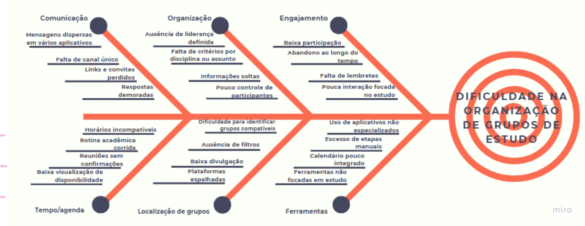

<b>Fonte: </b>Autoria de <a href="https://github.com/Acciolyy">Thiago Viriato Accioly</a>

## 1.2.4. Contribuições Individuais

### Contribuições - Mapa Mental

  
Camila Cavalcante

  

 Figura 3 - Mapa Mental Camila Cavalcante

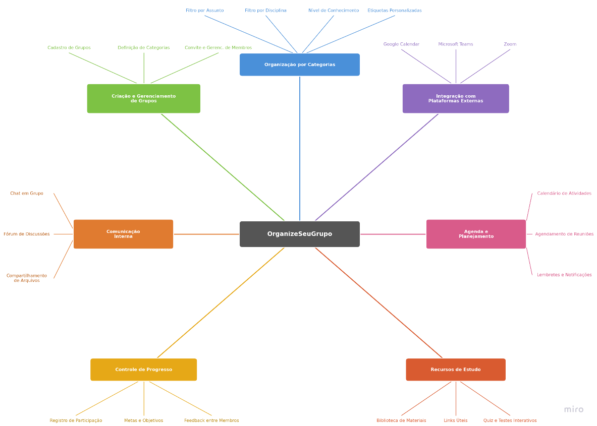

<b>Fonte: </b>Autoria de <a href="https://github.com/camilasilvac"> Camila Cavalcante</a>

 

  
 Luísa de Souza Ferreira

  
  
 Figura 4 - Mapa Mental de  Luísa de Souza

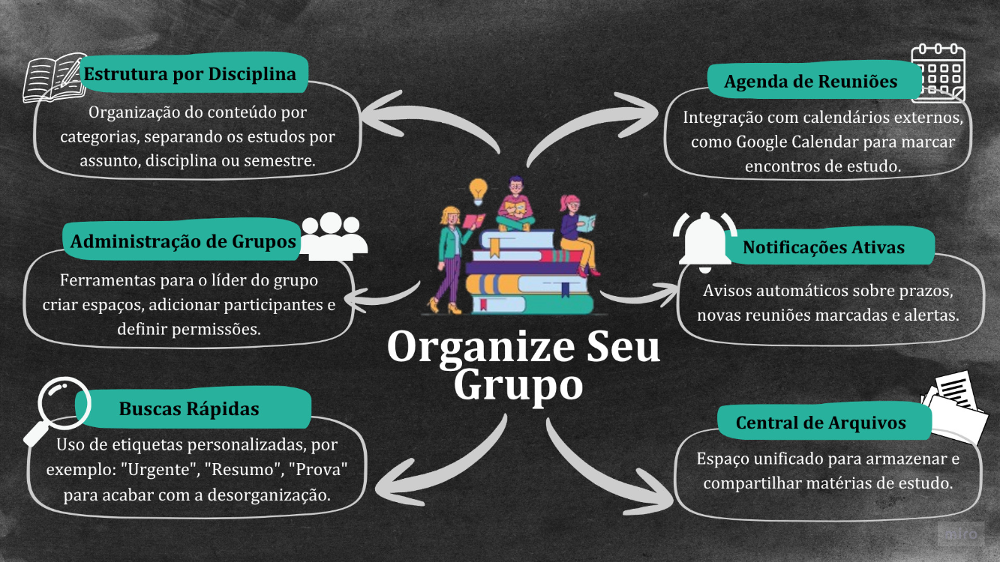

<b>Fonte: </b>Autoria de <a href="https://github.com/luisa12ll
"> Luísa de Souza Ferreira</a>

  

  
Julio Cesar

  
  
 Figura 5 - Mapa Mental de Julio Cesar

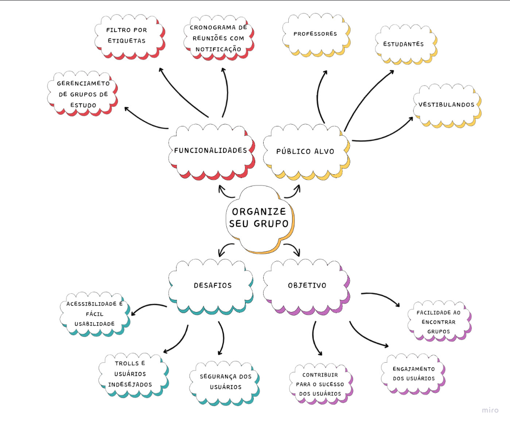

<b>Fonte: </b>Autoria de <a href="https://github.com/julnox
"> Julio Cesar</a> 

  

  
Lucas Alves Oliveira dos Santos

  
  
 Figura 6 - Mapa Mental de Lucas Alves

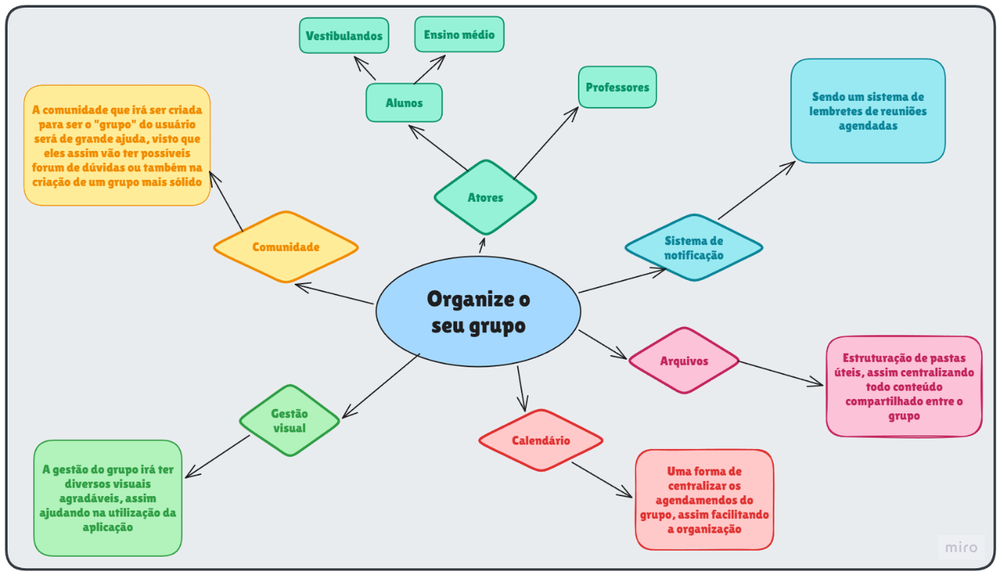

<b>Fonte: </b>Autoria de <a href="https://github.com/LucasAlves71
"> Lucas Alves Oliveira dos Santos</a> 

  
  

  
Marcus Vinicius Cunha Dantas

  
  
 Figura 7 - Mapa Mental de Marcus Vinicius

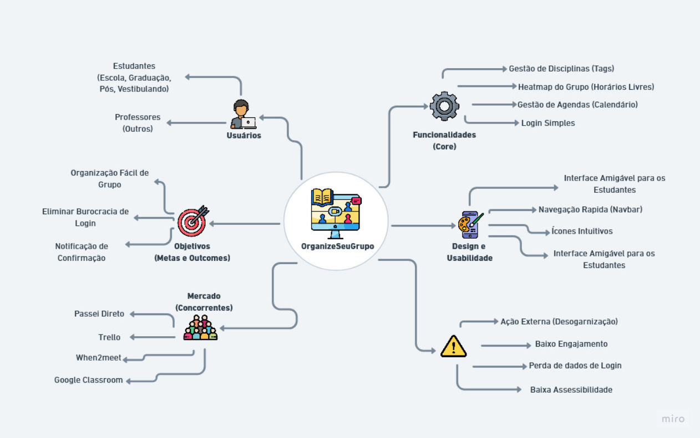

<b>Fonte: </b>Autoria de <a href="https://github.com/MarcusVcd"> Marcus Vinicius</a> 

  
    

### Contribuições - Mapa de Empatia

  
Julio Cesar

  
  
 Figura 8 - Mapa de Empatia Julio Cesar

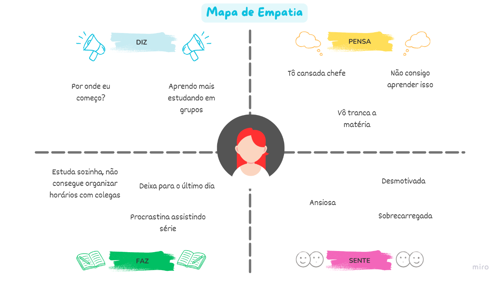

<b>Fonte: </b>Autoria de <a href="https://github.com/julnox
"> Julio Cesar</a> 

  

### Contribuições - Rich Picture

  
Mayara Marques Silva

  

 Figura 9 - Rich Picture de Mayara Marques

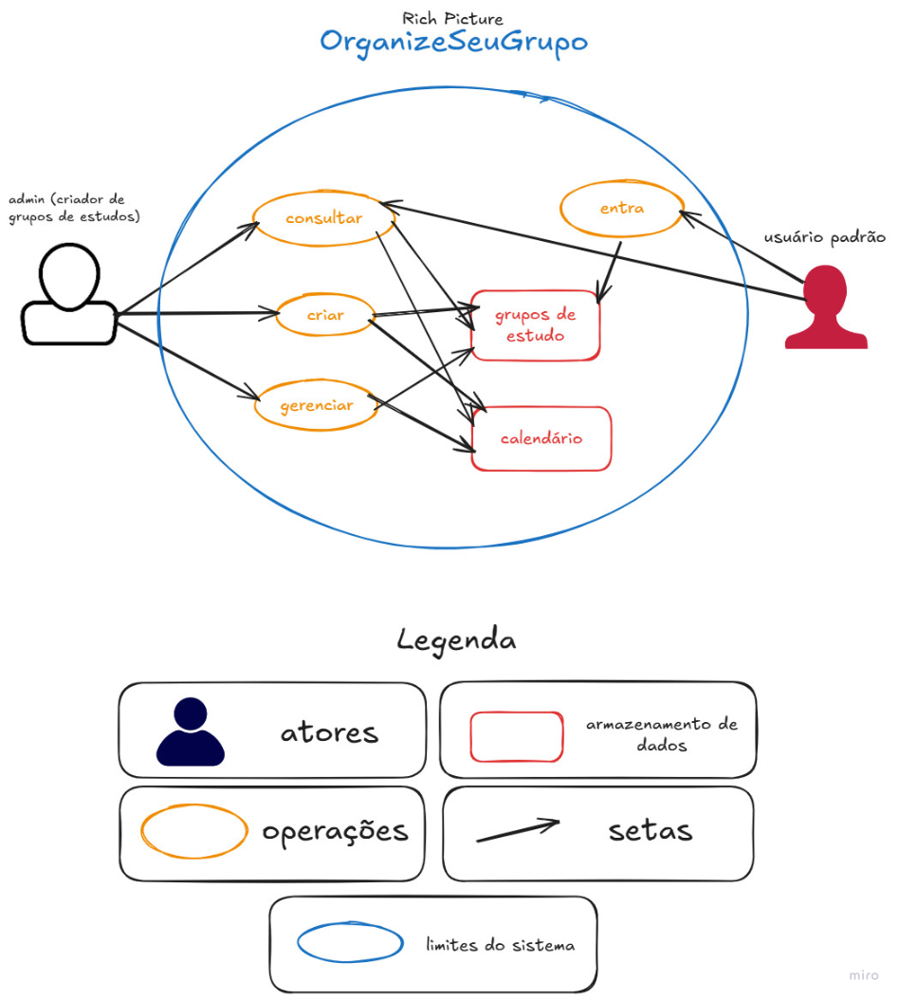

<b>Fonte: </b>Autoria de <a href="https://github.com/maymarquee
"> Mayara Marques</a>

### Contribuições - 5W2H

  
 Gabriel Sampaio Fae

  

 Figura 10 - 5W2H de Gabriel Sampaio Fae

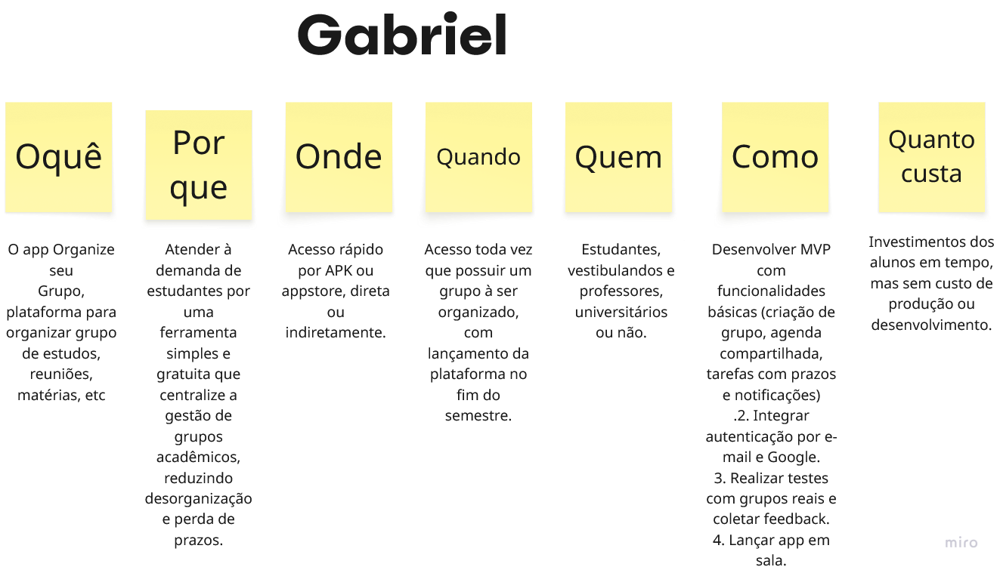

<b>Fonte: </b>Autoria de <a href="https://github.com/faehzin
"> Gabriel Sampaio</a>

  
 Eduardo de Pina Moreira Santos

  

 Figura 11 - 5W2H de Eduardo de Pina

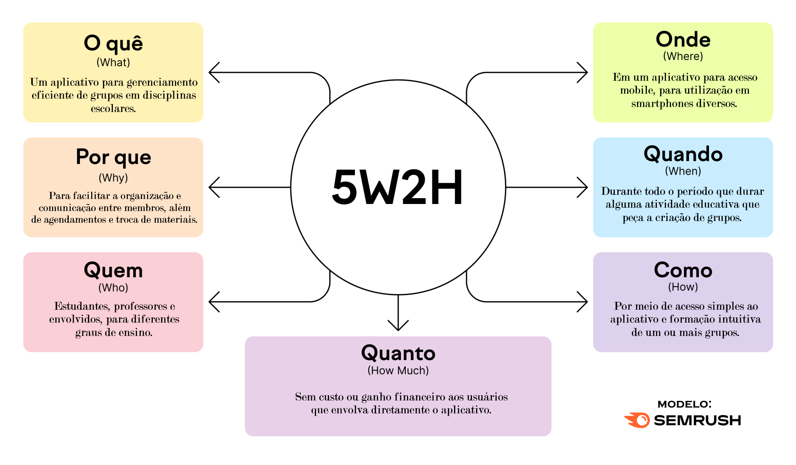

<b>Fonte: </b>Autoria de <a href="https://github.com/eduardodpms
">Eduardo de Pina</a>

  
 Pedro Everton de Paula

  

 Figura 12 - 5W2H de Pedro Everton de Paula

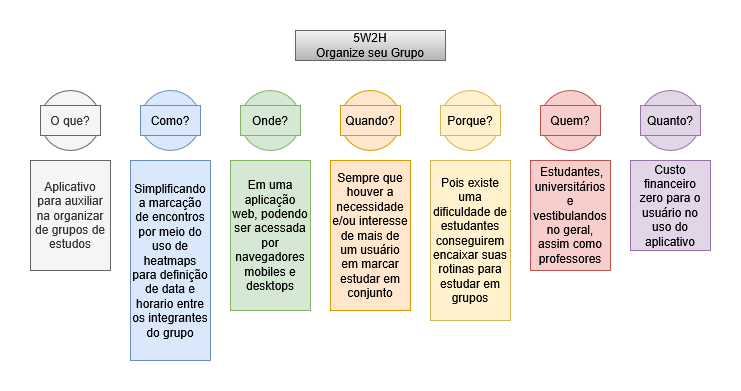

<b>Fonte: </b>Autoria de <a href="https://github.com/pedro-everton
"> Pedro Everton</a>

## Quadro de Colaboração dos Artefatos Generalistas

<a>Tabela 1:</a> Quadro de colaboração dos Artefatos Generalistas

| **Aluno**                           | **Participação**                                                  |
|-------------------------------------|-------------------------------------------------------------------|
| Camila Cavalcante                    | Contribuiu na elaboração do artefato no [Miro](https://miro.com/app/board/uXjVGp7zBtg=/?share_link_id=96260871432) |
| Eduardo de Pina           | Contribuiu na elaboração do artefato no [Miro](https://miro.com/app/board/uXjVGp7zBtg=/?share_link_id=96260871432) |
| Gabriel Sampaio Fae             | Contribuiu na elaboração do artefato no [Miro](https://miro.com/app/board/uXjVGp7zBtg=/?share_link_id=96260871432) |
| Júlio César Costa            | Contribuiu na elaboração do artefato no [Miro](https://miro.com/app/board/uXjVGp7zBtg=/?share_link_id=96260871432) |
| Lucas Alves Oliveira dos Santos               | Contribuiu na elaboração do artefato no [Miro](https://miro.com/app/board/uXjVGp7zBtg=/?share_link_id=96260871432) |
| Luísa de Souza Ferreira              | Contribuiu na elaboração do artefato no [Miro](https://miro.com/app/board/uXjVGp7zBtg=/?share_link_id=96260871432) |
| Marcus Vinicius Cunha Dantas     | Contribuiu na elaboração do artefato no [Miro](https://miro.com/app/board/uXjVGp7zBtg=/?share_link_id=96260871432) |
| Mayara Marques Silva               | Contribuiu na elaboração do qartefato no [Miro](https://miro.com/app/board/uXjVGp7zBtg=/?share_link_id=96260871432) |
| Pedro Everton de Paula  | Contribuiu na elaboração do artefato no [Miro](https://miro.com/app/board/uXjVGp7zBtg=/?share_link_id=96260871432) |
| Thiago Viriato Accioly  | Contribuiu na elaboração do artefato no [Miro](https://miro.com/app/board/uXjVGp7zBtg=/?share_link_id=96260871432) |

<b>Fonte: </b>Autoria de <a href="https://github.com/luisa12ll">Luisa de Souza</a>

## 1.2.6. Referências Bibliográficas

> *SANDER, C.* 5W2H: o que é, para que serve e por que usar na sua empresa. Sebrae SC, \[s.d.]. Disponível em: [https://www.sebrae-sc.com.br/blog/5w2h-o-que-e-para-que-serve-e-por-que-usar-na-sua-empresa](https://www.sebrae-sc.com.br/blog/5w2h-o-que-e-para-que-serve-e-por-que-usar-na-sua-empresa). Acesso em: 2 de abril de 2026.

> MONK, Andrew; HOWARD, Steve. **The Rich Picture**: A Tool for Reasoning About Work Context.  Disponível em: [https://ics.uci.edu/~wscacchi/Software-Process/Readings/RichPicture.pdf](https://ics.uci.edu/~wscacchi/Software-Process/Readings/RichPicture.pdf). Acesso em: 3 abr. 2026.

> *ZHUKOVA, N.* Diagrama Ishikawa: o que é, para que serve e como usar o diagrama espinha de peixe. Disponível em: [https://pt.semrush.com/blog/diagrama-ishikawa/](https://pt.semrush.com/blog/diagrama-ishikawa/?g_network=g&g_campaign=BR_POR_SRCH_DSA_Blog_PT&g_acctid=888-874-7704&g_keyword=&g_keywordid=dsa-2227432791347&g_adtype=search&g_adid=678287389888&g_campaignid=19241772885&g_adgroupid=158827185790&kw=&cmp=BR_POR_SRCH_DSA_Blog_PT&label=dsa_pagefeed&Network=g&Device=c&utm_content=678287389888&kwid=dsa-2227432791347&cmpid=19241772885&agpid=158827185790&BU=Core&extid=109814358042&adpos=&matchtype=&gad_source=1&gad_campaignid=19241772885&gclid=Cj0KCQjwyr3OBhD0ARIsALlo-Ol_etEtw24kpZqj4aBamXRj3P4wyn52qGJYWFWyzIQueXzfBPk4BGcaAigrEALw_wcB). Acesso em: 3 de abril de 2026.

## Histórico de Versões

| Versão | Data       | Descrição                   | Autor                      | Revisor |
| :----: | :--------- | :-------------------------- | :------------------------- | :------ |
| `1.0`  | 02/04/2026 | Criação do documento e adição da parte da dupla | [Lucas Alves Oliveira dos Santos](https://github.com/LucasAlves71) e [Thiago Viriato Accioly](ttps://github.com/Acciolyy)| [Eduardo de Pina Moreira Santos](https://github.com/eduardodpms)|
| `1.1`  | 03/04/2026 | Adicionado documentação dos Artefatos  | [Marcus Vinicius](https://github.com/MarcusVcd)               | [Julio Cesar](https://github.com/julnox)         |
| `1.2`  | 04/04/2026 | Adição de Rich Picture | [Mayara Marques](https://github.com/maymarquee)| [Luisa de Souza](https://github.com/luisa12ll)|
| `1.3`  | 04/04/2026 | Adição dos Artefatos Individuais | [Marcus Vinicius](https://github.com/MarcusVcd) | [Julio Cesar](https://github.com/julnox)  |
| `1.4`  | 05/04/2026 | Adição dos Artefatos Individuais | [Eduardo de Pina](https://github.com/eduardodpms) | [Mayara Marques](https://github.com/maymarquee)  |
| `1.5`  | 05/04/2026 | Correção de path das imagens | [Eduardo de Pina](https://github.com/eduardodpms) | [Mayara Marques](https://github.com/maymarquee)  |
| `1.6`   |05/04/2026 | Adicionando a tabela de contribuição | [Luisa de Souza](https://github.com/luis12ll)| Thiago Viriato Accioly](https://github.com/Acciolyy) | 