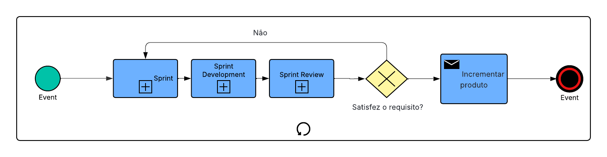
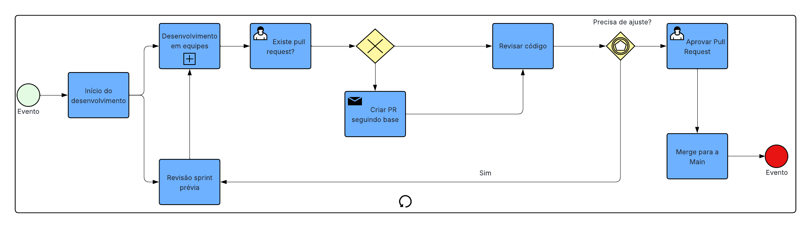
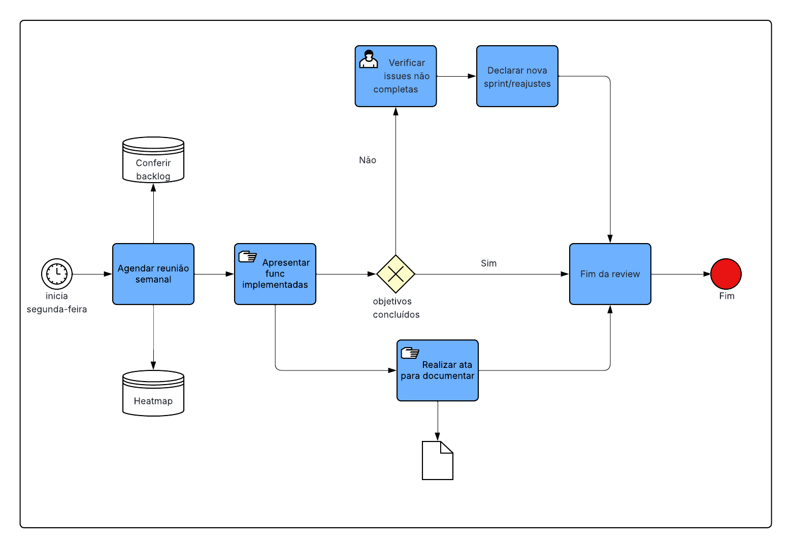
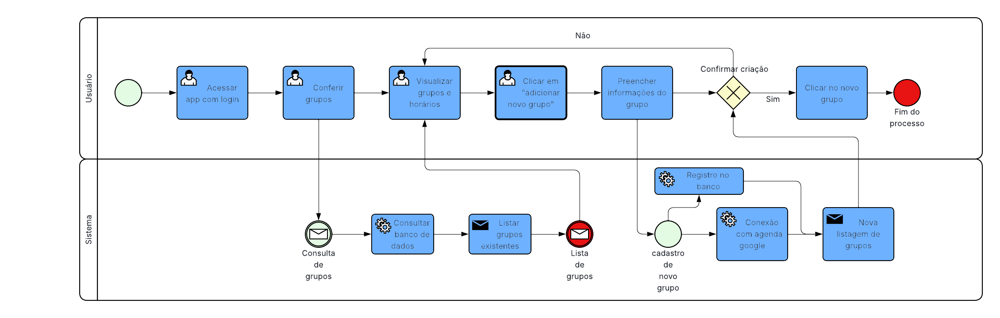
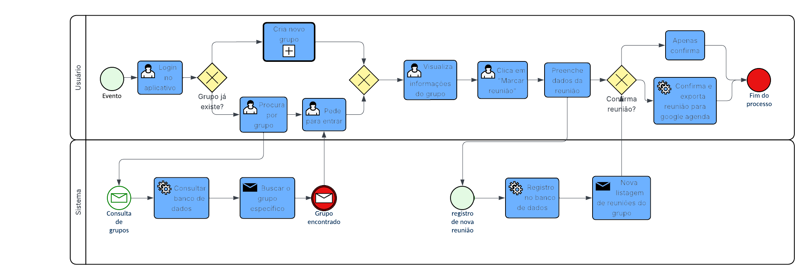

# 1.3.1. Modelagem BPMN

## 1.3.1.1. Introdução

O BPMN (Business Process Model and Notation), ou modelagem e notação de processos de negócio, atua como um padrão internacional para ilustrar processos de negócio graficamente. Essa notação facilita o entendimento e a comunicação clara sobre os fluxos de trabalho entre os diversos envolvidos em um projeto.

A notação foi idealizada pela Business Process Management Initiative (BPMI), uma instituição sem fins lucrativos que criou o modelo inicialmente sob o nome de Business Process Modeling Notation. Em 2005, a BPMI foi incorporada pelo Object Management Group (OMG), que passou a cuidar da atualização e padronização do BPMN desde então.

## 1.3.1.2. Principais Abstrações da BPMN
### 1.3.1.2.1. Objetos do Fluxo

#### Eventos

Eventos são ocorrências que se dão ao longo do andamento de um processo. Podem sinalizar onde o fluxo começa, onde ele termina, ou até mesmo acontecimentos pontuais no meio do caminho. Para ilustrar, "Criação de Grupo de Estudos" seria um evento inicial, ao passo que "Aguardando Confirmação de Participantes" funcionaria como um evento intermediário, finalizando com algo como "Sessão de Estudo Concluída" para o encerramento.

#### Atividades

Atividades representam as ações ou tarefas práticas que necessitam ser executadas no decorrer do processo. Geralmente, as tarefas se dividem nos seguintes tipos:

- **Tarefa Humana:** ação feita por um indivíduo, que muitas vezes utiliza algum software ou sistema de gestão para dar suporte;

- **Tarefa Manual:** trabalho feito totalmente à mão, sem o envolvimento de tecnologias ou aplicativos;

- **Business Rule:** tarefa voltada à aplicação de uma norma ou regra da organização, viabilizando que o processo tome decisões de forma automática;

- **Script:** ação em que um bloco de código ou script é rodado, servindo para automatizar passos específicos dentro do fluxo.

#### Gateways

Gateways funcionam como controladores de fluxo ou pontos onde decisões são tomadas. Eles são responsáveis por definir se o caminho do processo vai se dividir ou se juntar, sempre com base em certas regras ou critérios:

- **Exclusivo (XOR):** guia o fluxo por somente uma das rotas disponíveis dependendo de uma condição, como aceitar ou rejeitar um convite para o grupo.

- **Inclusivo (OR):** possibilita seguir por várias rotas ao mesmo tempo, caso as condições sejam atendidas, como disparar avisos para membros distintos segundo suas escolhas de contato.

- **Paralelo (AND):** faz com que todas as vias traçadas ocorram de modo simultâneo, independentemente de condições, a exemplo de atualizar a agenda e disparar a confirmação de presença de uma só vez.

- **Baseado em evento:** o direcionamento do fluxo depende de fatos de fora ou de dentro do sistema, como o recebimento de um material ou a chegada da confirmação de um membro.

- **Complexo:** une critérios mais elaborados que não se encaixam nos demais gateways, gerando decisões e fluxos mais robustos, como seguir diferentes ramificações a partir de uma junção de várias regras.

### 1.3.1.2.2. Objetos de Conexão

#### Fluxo de Sequência

O fluxo de sequência é o recurso visual no BPMN que dita a ordem cronológica em que as atividades acontecem no processo. Ele conecta tarefas, eventos e gateways, desenhando o percurso exato de como as etapas vão se desenrolando.

#### Fluxo de Mensagem

O fluxo de mensagem serve para ilustrar a troca de informações entre partes diferentes que interagem no processo. Ao contrário do fluxo de sequência, que acontece dentro de um mesmo escopo (ou piscina), o fluxo de mensagem faz a ponte entre pools separados, evidenciando o caminho que os dados percorrem.

#### Associação

A associação é usada no diagrama BPMN para ligar anotações ou documentos aos componentes do processo, mas sem causar nenhum impacto real na forma como ele é executado. Trata-se de algo voltado para a documentação, permitindo incluir considerações extras que ajudam quem está lendo a entender melhor o modelo.

### 1.3.1.2.3. Pistas de Responsabilidade (Swimlanes)

#### Piscina (Pool)

A piscina, ou pool, é um quadro que engloba um dos participantes de um processo de negócio. Em grande parte das vezes, todo o processo fica dentro de uma só piscina, embora haja cenários com múltiplas estruturas. Às vezes, uma piscina pode ser desenhada fechada (como uma "caixa preta"), o que apenas sinaliza a existência de um participante externo sem entrar em detalhes do seu funcionamento.

#### Raia (Lane)

As raias (lanes) são subdivisões dentro de uma piscina e ajudam a dar mais organização às atividades. Mesmo sem regras estritas do BPMN sobre como usá-las, o mais comum é que cada raia represente um departamento, um sistema ou o papel de um funcionário, de forma a deixar claro quem é responsável por cada etapa.

# 1.3.2 Processo do grupo

Utilizando os preceitos vistos acima, modelamos o diagrama BPMN do aplicativo OrganizeSeuGrupo, utilizando como base a metodologia **Scrum**, com adaptações.

Após avaliação geral, decidimos não possuir um Product Owner formal, considerando maximizar o valor entregue junto de atualização de backlog assumindo papéis variáveis ao decorrer do projeto. Optamos também por um **Daily Scrum** sob demanda, já que podemos inspecionar progresso e adaptar via canais assíncronos, reduzindo acúmulo de reuniões. O processo de desenvolvimento se baseia em ciclos iterativos, com entregas incrementais a cada sprint, permitindo feedback e ajustes rápidos. Todos os processos de desenvolvimento, desde a concepção até a entrega, são modelados em um diagrama BPMN para garantir clareza e alinhamento entre os membros do grupo e anexados abaixo.

## 1.3.2.1 SPRINT

O diagrama apresentado na figura 1 representa o fluxo completo de uma Sprint dentro do framework Scrum, utilizando a notação BPMN para ilustrar as etapas e decisões envolvidas no processo de desenvolvimento do aplicativo OrganizeSeuGrupo.

O fluxo é simples: iniciamos o desenvolvimento atendendo a requisitos previamente definidos, passando por fases de revisão e testes. Assim, sempre obtemos dois resultados possíveis: ou o produto atende aos requisitos, ou não.

- Se não atender aos requisitos, retorna-se ao início da Sprint para ajustes e nova tentativa.
- Se sim, o produto é incrementado e o processo é finalizado.

**Figura 1 - Sprint**  

Autor: [Luísa de Souza](https://github.com/luisa12ll) e  [Mayara Marques](https://github.com/maymarquee)

## 1.3.2.2 SPRINT DEVELOPMENT

O diagrama apresentado na figura 2 detalha o processo de desenvolvimento dentro de uma Sprint, destacando as atividades específicas e os pontos de decisão que guiam o progresso do projeto OrganizeSeuGrupo. Iniciando, sempre, com um sprint planning, considerando as prioridades e objetivos da sprint, tendo em vista o tempo e o recurso disponível de cada aluno.

Em seguida, inicia-se o desenvolvimento em equipe, com reuniões diárias (Dailies) para acompanhamento. O fluxo verifica se já existe um Pull Request (PR):

- Se não existir, cria-se um PR;
- Se sim, o código é revisado.

Após a revisão, o fluxo verifica se são necessárias alterações:

- Se sim, volta-se ao desenvolvimento;
- Se não, o PR é aprovado e o merge é feito para a branch principal (main), finalizando o processo.

**Figura 2 - Sprint Development**  

Autor: [Marcus Vinicius](https://github.com/MarcusVcd) e [Thiago Accioly](https://github.com/Acciolyy) 

## 1.3.2.3 SPRINT REVIEW

O diagrama apresentado na figura 3 ilustra o processo de revisão de uma Sprint, destacando as etapas e decisões envolvidas na avaliação do trabalho realizado durante a Sprint. O processo começa com a apresentação do incremento do produto para todos do grupo, onde se verifica se o produto atende aos requisitos estabelecidos;

- Se não atender, o processo retorna para o início da Sprint para ajustes e nova tentativa, verificando backlog e realizando as devidas correções;
- Se atender, o processo é finalizado, com o incremento do produto sendo considerado completo e pronto para uso.

**Figura 3 - Sprint review**  

Autor: [Gabriel Fae](https://github.com/faehzin) e [Camila Silva](https://github.com/CamilaSilvaC)

# 1.3.3 Modelagem BPMN do OrganizeSeuGrupo

Abaixo estão os diagramas BPMN que modelam algumas funcionalidades do aplicativo OrganizeSeuGrupo, considerando o fluxo de atividades do usuário e as interações com o sistema.

**Figura 4 - Novo Grupo**  

Autor: [Eduardo de Pina](https://github.com/eduardodpms) e [Júlio César](https://github.com/julnox) 

**Figura 5 - Nova Reunião**  

Autor: [Pedro Everton](https://github.com/pedro-everton) e [Lucas Alves ](https://github.com/LucasAlves71)

## 1.3.4 Quadro de Colaboração do BPMN

<a>Tabela 1:</a> Quadro de colaboração do BPMN 

| **Aluno**                           | **Participação**                                                  |
|-------------------------------------|-------------------------------------------------------------------|
| Camila Cavalcante                    | Contribuiu na elaboração e desenvolvimento do BPMN|
| Eduardo de Pina           | Contribuiu na elaboração e desenvolvimento do BPMN |
| Gabriel Sampaio Fae             | Contribuiu na elaboração e desenvolvimento do BPMN|
| Júlio César Costa            | Contribuiu na elaboração e desenvolvimento do BPMN|
| Lucas Alves Oliveira dos Santos   | Contribuiu na elaboração e desenvolvimento do BPMN|
| Luísa de Souza Ferreira              | Contribuiu na elaboração e desenvolvimento do BPMN|
| Marcus Vinicius Cunha Dantas     | Contribuiu na elaboração e desenvolvimento do BPMN|
| Mayara Marques Silva               | Contribuiu na elaboração e desenvolvimento do BPMN|
| Pedro Everton de Paula  | Contribuiu na elaboração e desenvolvimento do BPMN |
| Thiago Viriato Accioly  | Contribuiu na elaboração e desenvolvimento do BPMN|

<b>Fonte: </b>Autoria de <a href="https://github.com/luisa12ll">Luisa de Souza</a>

## 1.3.5. Referências Bibliográficas

> **SGANDERLA, Kelly.** Um guia para iniciar estudos em BPMN I: Atividades e sequência. *I Process*, 19 nov. 2012. Disponível em: [https://blog.iprocess.com.br/2012/11/um-guia-para-iniciar-estudos-em-bpmn-i-atividades-e-sequencia/](https://blog.iprocess.com.br/2012/11/um-guia-para-iniciar-estudos-em-bpmn-i-atividades-e-sequencia/). Acesso em: 2 abr. 2026.

> **BELCIC, Ivan; STRYKER, Cole.** BPMN. *IBM*, 25 jun. 2024. Disponível em: [https://www.ibm.com/br-pt/think/topics/bpmn?mhsrc=ibmsearch\_a\&mhq=BPMN](https://www.ibm.com/br-pt/think/topics/bpmn?mhsrc=ibmsearch_a&mhq=BPMN). Acesso em: 2 abr. 2026.

> **VISUAL PARADIGM.** What is BPMN. *Visual Paradigm*, \[s.d.]. Disponível em: [https://www.visual-paradigm.com/guide/bpmn/what-is-bpmn/](https://www.visual-paradigm.com/guide/bpmn/what-is-bpmn/). Acesso em: 2 abr. 2026.

> **SERRANO, Milene.** Arquitetura e Desenho de Software – Aula BPMN Exemplos. *Aprender3 – UNB*, \[s.d.]. Disponível em: [https://aprender3.unb.br/pluginfile.php/3178527/mod\_page/content/2/Arquitetura%20e%20Desenho%20de%20software%20-%20Aula%20BPMN%20Exemplos%20-%20Profa.%20Milene.pdf](https://aprender3.unb.br/pluginfile.php/3178527/mod_page/content/2/Arquitetura%20e%20Desenho%20de%20software%20-%20Aula%20BPMN%20Exemplos%20-%20Profa.%20Milene.pdf). Acesso em: 2 abr. 2026.

## Histórico de Versões

|  Versão  | Data       | Descrição                   | Autor                      | Revisor |
| :------: | :--------- | :-------------------------- | :------------------------- | :------ |
|  `1.0`   | 02/04/2026 | Criação do documento e adição de sua estrutura |  [Thiago Viriato Accioly](https://github.com/Acciolyy) e [Lucas Alves Oliveira dos Santos](https://github.com/LucasAlves71)   | [Gabriel Fae](https://github.com/faehzin)        |
|  `1.1`   | 02/04/2026 | Correção de textos |  [Thiago Viriato Accioly](https://github.com/Acciolyy) e [Lucas Alves Oliveira dos Santos](https://github.com/LucasAlves71)   | [Gabriel Fae](https://github.com/faehzin)        |
| `1.2`   | 05/04/2026 | Adição de diagramas BPMN do nosso projeto e do fluxo SCRUM |  [Gabriel Fae](https://github.com/faehzin)   | [Thiago Viriato Accioly](https://github.com/Acciolyy)   |
| `1.3`   | 05/04/2026 | Adição de imagens |  [Gabriel Fae](https://github.com/faehzin)   | [Thiago Viriato Accioly](https://github.com/Acciolyy)   |
| `1.4`   |05/04/2026 | Adicionando a tabela de contribuição | [Luisa de Souza](https://github.com/luis12ll)| [Thiago Viriato Accioly](https://github.com/Acciolyy) | 
| `1.5`   |05/04/2026 | Adição de diagrama BPMN | [Pedro Everton](https://github.com/pedro-everton)| [Gabriel Fae](https://github.com/faehzin) | 

