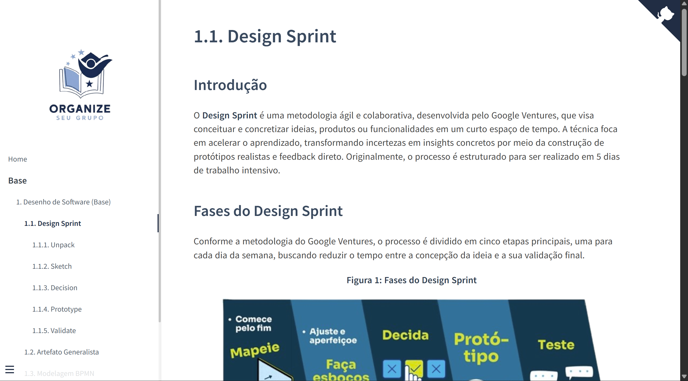
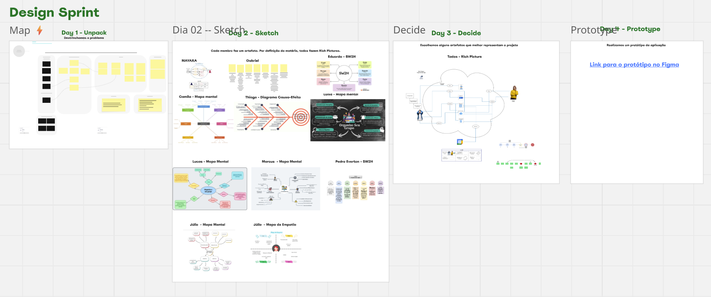
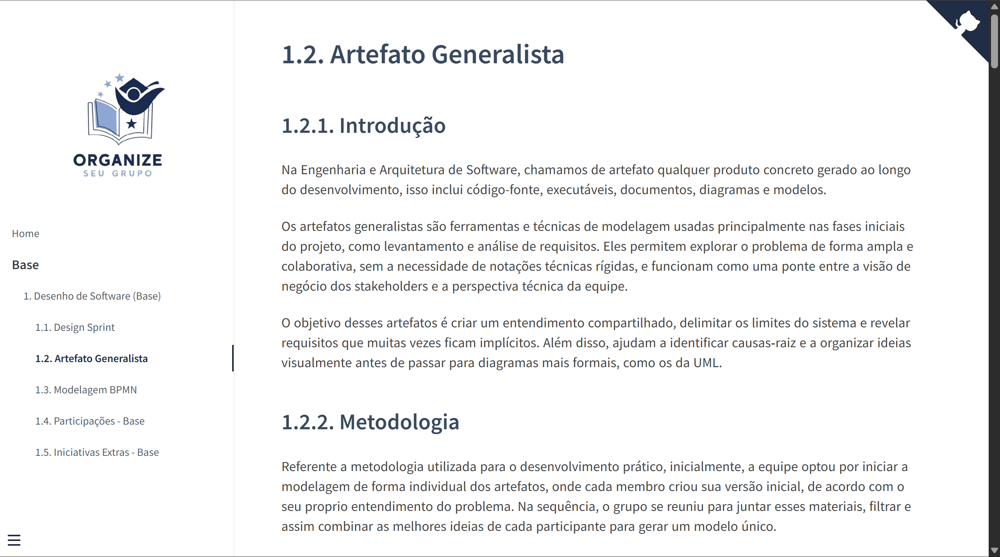
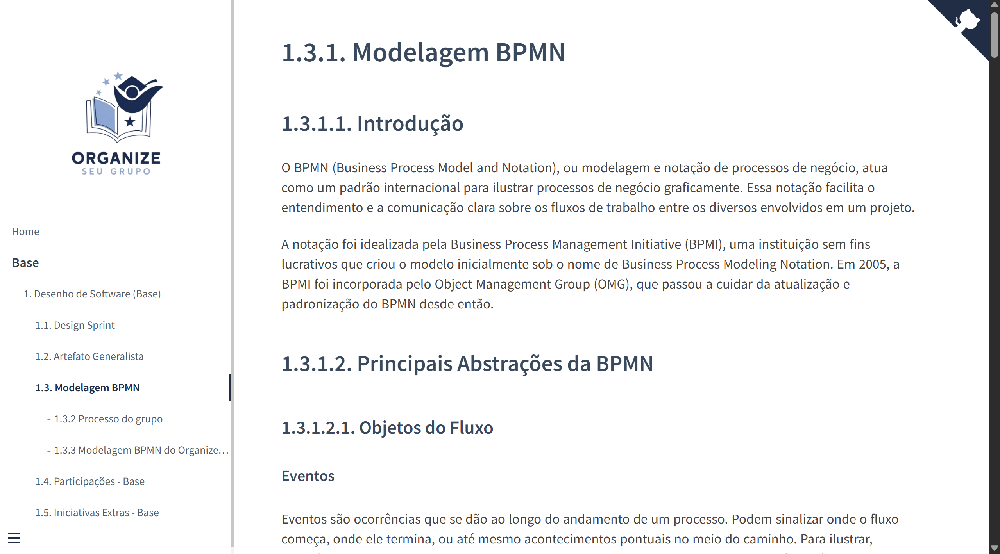
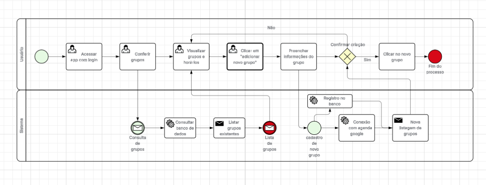

# OrganizeSeuGrupo

**Código da Disciplina**: FGA0208 
**Número do Grupo**: 02 
**Entrega**: 01 

## Alunos

|Matrícula | Aluno |
| -- | -- |
| 23/2013944 | Camila Cavalcante |
| 23/1034494  |  Eduardo de Pina |
| 23/1011382  |  Gabriel Sampaio Fae |
| 21/1031744 | Júlio César Costa |
| 23/1027159 | Lucas Alves Oliveira dos Santos |
| 23/2014807 | Luísa de Souza Ferreira |
| 21/1031403 | Marcus Vinicius Cunha Dantas |
| 23/1035731 | Mayara Marques Silva |
| 22/1008768 | Pedro Everton de Paula |
| 23/1029340 | Thiago Viriato Accioly |

## Sobre 

O OrganizeSeuGrupo é um web-app que centraliza a organização de grupos de estudo em um só lugar, reunindo estudantes, professores e vestibulandos em um ambiente estruturado e intuitivo. A plataforma permite visualizar encontros por meio de calendários interativos, com informações como data, horário, tema da sessão e participantes envolvidos. Usuários autenticados podem filtrar atividades por matéria, tags ou palavras-chave, facilitando encontrar exatamente o conteúdo que precisam revisar e as reuniões planejadas para o sua organização e aprendizado!

## Screenshots da Primeira Entrega

<strong>Figura 1 e 2: Artefato de Design Sprint</strong>

<b>Fonte:</b> Autoria de <a href="https://github.com/maymarquee">Mayara Marques</a>.

<strong>Figura 3 e 4: Artefato Generalista</strong>

<b>Fonte:</b> Autoria de <a href="https://github.com/maymarquee">Mayara Marques</a>.

<strong>Figura 4: Artefato BPMN</strong>

<b>Fonte:</b> Autoria de <a href="https://github.com/maymarquee">Mayara Marques</a>.

## Há algo a ser executado?

( ) SIM

(X) NÃO

Se SIM, insira um manual (ou um script) para auxiliar ainda mais os interessados na execução.

## Histórico de Versões

| Versão | Data       | Descrição | Autor     |       Revisor         |
| ------ | ---------- | --------- | --------- | --------------------- |
| `1.0` | 05/04/2025 | Criação do documento e adicionando informações|[Luísa de Souza](https://github.com/luisa12ll) | [Lucas Alves Oliveira dos Santos](https://github.com/LucasAlves71) |
| `1.1` | 05/04/2025 | Adiciona screenshots da entrega 1|[Mayara Marques](https://github.com/maymarquee) | [Eduardo de Pina](https://github.com/eduardodpms) |

